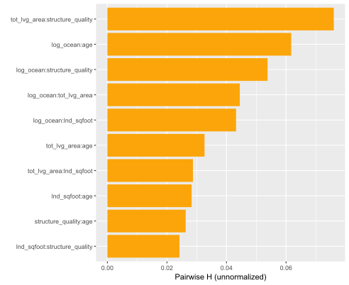
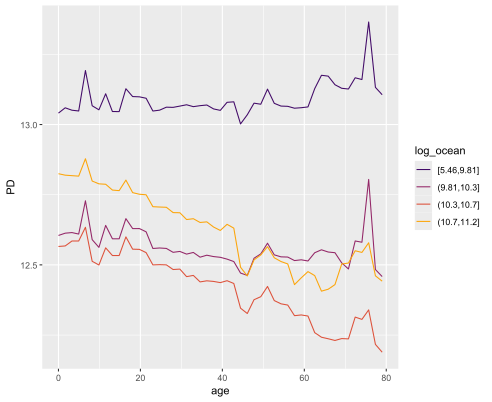
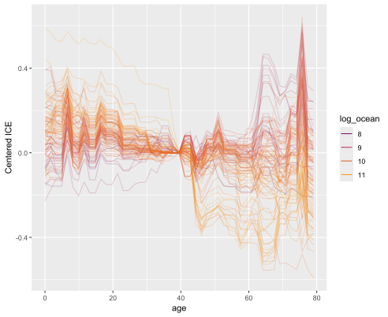
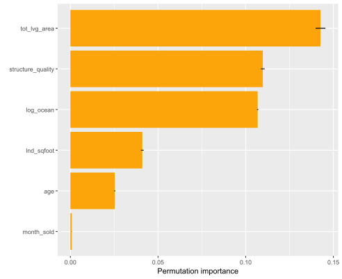

# hstats <a href='https://github.com/mayer79/hstats'></a>

<!-- badges: start -->

[](https://cran.r-project.org/package=hstats)
[](https://github.com/mayer79/hstats/actions)
[](https://app.codecov.io/gh/mayer79/hstats?branch=main)

[](https://cran.r-project.org/package=hstats) 
[](https://cran.r-project.org/package=hstats)

<!-- badges: end -->

## Overview

**What makes a ML model black-box? It's the interactions!**

The first step in understanding interactions is to measure their strength. This is exactly what Friedman and Popescu's H-statistics [1] do:

| Statistic   | Short description                        | How to read its value?                                                                                |
|-------------|------------------------------------------|-------------------------------------------------------------------------------------------------------|
| $H^2_j$     | Overall interaction strength per feature | Proportion of prediction variability explained by interactions on feature $j$.                        |
| $H^2_{jk}$  | Pairwise interaction strength            | Proportion of joint effect variability of features $j$ and $k$ coming from their pairwise interaction.|
| $H^2_{jkl}$ | Three-way interaction strength           | Proportion of joint effect variability of three features coming from their three-way interaction.     |

See section [Background](#background) for details and definitions.

{hstats} offers these statistics comparably **fast** and for **any model**, even for multi-output models, or models with case weights. Additionally, we provide a global statistic $H^2$ measuring the proportion of prediction variability unexplained by main effects [5], and an experimental feature importance measure. After having identified strong interactions, their shape can be investigated by stratified partial dependence or ICE plots.

The core functions `hstats()`, `partial_dep()`, `ice()`, `perm_importance()`, and `average_loss()` can directly be applied to DALEX explainers, meta learners (mlr3, tidymodels, caret) and most other models. In case you need more flexibility, a tailored prediction function can be specified. Both data.frame and matrix data structures are supported.

## Limitations

1. H-statistics are based on partial dependence estimates and are thus as good or bad as these. One of their problems is that the model is applied to unseen/impossible feature combinations. In extreme cases, H-statistics intended to be in the range between 0 and 1 can become larger than 1. Accumulated local effects (ALE) [8] mend above problem of partial dependence estimates. They, however, depend on the notion of "closeness", which is highly non-trivial in higher dimension and for discrete features.
2. Due to their computational complexity, H-statistics are usually evaluated on relatively small subsets of the training (or validation/test) data. Consequently, the estimates are typically not very robust. To get more robust results, increase the default `n_max = 300` of `hstats()`.

## Landscape

{hstats} is not the first R package to explore interactions. Here is an incomplete selection:

- [{gbm}](https://CRAN.R-project.org/package=gbm): Implementation of m-wise interaction statistics of [1] for {gbm} models using the weighted tree-traversal method of [2] to estimate partial dependence functions.
- [{iml}](https://CRAN.R-project.org/package=iml): Variant of pairwise interaction statistics of [1].
- [{EIX}](https://CRAN.R-project.org/package=EIX): Interaction statistics extracted from the tree structure of XGBoost and LightGBM.
- [{randomForestExplainer}](https://CRAN.R-project.org/package=randomForestExplainer): Interaction statistics extracted from the tree structure of random forests.
- [{vivid}](https://CRAN.R-project.org/package=vivid): Cool visualization of interaction patterns. Partly based on {flashlight}.
- [{flashlight}](https://CRAN.R-project.org/package=flashlight): Model-agnostic implementation of some statistics of [1]. Planned to switch to the much faster {hstats}.

## Installation

```r
# From CRAN
install.packages("hstats")

# From Github
devtools::install_github("mayer79/hstats")
```

## Usage

To demonstrate the typical workflow, we use a beautiful house price dataset with about 14,000 transactions from Miami-Dade County available in the {shapviz} package, and analyzed in [3]. We are going to model logarithmic sales prices with XGBoost.

### Fit model

```r
library(ggplot2)
library(hstats)
library(xgboost)
library(shapviz)

colnames(miami) <- tolower(colnames(miami))
miami$log_ocean <- log(miami$ocean_dist)
x <- c("log_ocean", "tot_lvg_area", "lnd_sqfoot", "structure_quality", "age", "month_sold")

# Train/valid split
set.seed(1)
ix <- sample(nrow(miami), 0.8 * nrow(miami))

y_train <- log(miami$sale_prc[ix])
y_valid <- log(miami$sale_prc[-ix])
X_train <- data.matrix(miami[ix, x])
X_valid <- data.matrix(miami[-ix, x])

dtrain <- xgb.DMatrix(X_train, label = y_train)
dvalid <- xgb.DMatrix(X_valid, label = y_valid)

# Fit via early stopping
fit <- xgb.train(
  params = list(learning_rate = 0.15, objective = "reg:squarederror", max_depth = 5),
  data = dtrain,
  watchlist = list(valid = dvalid),
  early_stopping_rounds = 20,
  nrounds = 1000,
  callbacks = list(cb.print.evaluation(period = 100))
)

# Mean squared error: 0.0515
average_loss(fit, X = X_valid, y = y_valid)
```

### Interaction statistics

Let's calculate different H-statistics via `hstats()`:

```r
# 3 seconds on simple laptop - a random forest will take 1-2 minutes
set.seed(782)
system.time(
  s <- hstats(fit, v = x, X = X_train)
)
s
# Proportion of prediction variability unexplained by main effects of v
# [1] 0.10

plot(s)  # Or summary(s) for numeric output

# Save for later
# saveRDS(s, file = "h_statistics.rds")
```


**Interpretation** 

- $H^2$: About 10% of prediction variability is unexplained by the sum of all main effects. The interaction effects seem to be important.
- $H^2_j$: The strongest overall interactions are associated with "log_ocean" (logarithmic distance to the ocean): About 6% of prediction variability can be attributed to its interactions.
- $H^2_{jk}$: About 8.5% of the joint effect variability of "log_ocean" and "age" comes from their pairwise interaction.

**Remarks**

1. Pairwise statistics $H^2_{jk}$ are calculated only for the features with strong overall interactions $H^2_j$.
2. H-statistics need to repeatedly calculate predictions on up to $n^2$ rows. That is why {hstats} samples 300 rows by default. To get more robust results, increase this value at the price of slower run time.
3. Pairwise statistics $H^2_{jk}$ measures interaction strength relative to the combined effect of the two features. This does not necessarily show which interactions are strongest in absolute numbers. To do so, we can study unnormalized statistics:

```r
h2_pairwise(s, normalize = FALSE, squared = FALSE, top_m = 5)
```



Since distance to the ocean and age have high values in overall interaction strength, it is not surprising that a strong relative pairwise interaction is translated into a strong absolute one.

{hstats} crunches three-way interaction statistics $H^2_{jkl}$ as well. The following plot shows them together with the other statistics on prediction scale (`normalize = FALSE` and `squared = FALSE`). The three-way interactions are weaker than the pairwise interactions, yet not negligible:

```r
plot(s, which = 1:3, normalize = F, squared = F, facet_scales = "free_y", ncol = 1)
```


### Describe interaction

Let's study different plots to understand *how* the strong interaction between distance to the ocean and age looks like. We will check the following three visualizations.

1. Stratified PDP
2. Two-dimensional PDP
3. Centered ICE plot with colors

They all reveal a substantial interaction between the two variables in the sense that the age effect gets weaker the closer to the ocean. Note that numeric `BY` features are automatically binned into quartile groups.

```r
plot(partial_dep(fit, v = "age", X = X_train, BY = "log_ocean"))
```



```r
pd <- partial_dep(fit, v = c("age", "log_ocean"), X = X_train, grid_size = 1000)
plot(pd)
```


```r
ic <- ice(fit, v = "age", X = X_train, BY = "log_ocean")
plot(ic, center = TRUE)
```



The last figure tries to visualize the strongest three-way interaction, without much success though:

```r
BY <- data.frame(X_train[, c("age", "log_ocean")])
BY$log_ocean <- BY$log_ocean < 10
plot(ice(fit, v = "tot_lvg_area", X = X_train, BY = BY), center = TRUE)
```


### Variable importance

In the spirit of [1], and related to [4], we can extract from the "hstats" objects a partial dependence based variable importance measure. It measures not only the main effect strength (see [4]), but also all its interaction effects. It is rather experimental, so use it with care (details in the section "Background"):

```r
pd_importance(s) +
  ggtitle("PD-based importance (experimental)")

# Compared with repeated permutation importance regarding MSE (with standard errors)
plot(perm_importance(fit, v = x, X = X_valid, y = y_valid)) +
  ggtitle("Permutation importance")
```


Permutation importance returns the same order in this case:




## DALEX

The main functions work smoothly on DALEX explainers:

```r
library(DALEX)
library(ranger)
library(hstats)

set.seed(1)

fit <- ranger(Sepal.Length ~ ., data = iris)
ex <- explain(fit, data = iris[-1], y = iris[, 1])

s <- hstats(ex)
s  # Non-additivity index 0.054
plot(s)

# Strongest relative interaction
plot(ice(ex, v = "Sepal.Width", BY = "Petal.Width"), center = TRUE)
plot(partial_dep(ex, v = "Sepal.Width", BY = "Petal.Width"), show_points = FALSE)
plot(partial_dep(ex, v = c("Sepal.Width", "Petal.Width"), grid_size = 200))

# Check permutation importance
perm_importance(ex)
```


Strongest relative interaction shown as ICE plot.


## Multivariate responses

{hstats} works also with multivariate output such as probabilistic classification.

```r
library(ranger)
library(ggplot2)
library(hstats)

fit <- ranger(Species ~ ., data = iris, probability = TRUE, seed = 1)
average_loss(fit, X = iris, y = iris$Species, loss = "mlogloss")  # 0.054

s <- hstats(fit, v = colnames(iris)[-5], X = iris)
s
# Proportion of prediction variability unexplained by main effects of v:
#      setosa  versicolor   virginica 
# 0.002705945 0.065629375 0.046742035

plot(s, normalize = FALSE, squared = FALSE) +
  ggtitle("Unnormalized statistics") +
  scale_fill_viridis_d(begin = 0.1, end = 0.9)

ice(fit, v = "Petal.Length", X = iris, BY = "Petal.Width", n_max = 150) |> 
  plot(center = TRUE) +
  ggtitle("Centered ICE plots")
```


## Meta-learning packages

Here, we provide some working examples for "tidymodels", "caret", and "mlr3".

### tidymodels

```r
library(tidymodels)
library(hstats)

iris_recipe <- iris %>%
  recipe(Sepal.Length ~ .)

reg <- linear_reg() %>%
  set_engine("lm")
  
iris_wf <- workflow() %>%
  add_recipe(iris_recipe) %>%
  add_model(reg)

fit <- iris_wf %>%
  fit(iris)
  
s <- partial_dep(fit, v = "Petal.Width", X = iris)
plot(s)
```

### caret

```r
library(caret)
library(hstats)

fit <- train(
  Sepal.Length ~ ., 
  data = iris, 
  method = "lm", 
  tuneGrid = data.frame(intercept = TRUE),
  trControl = trainControl(method = "none")
)

s <- ice(fit, v = "Petal.Width", X = iris)
plot(s, center = TRUE)
```

### mlr3

```r
library(hstats)
library(mlr3)
library(mlr3learners)

# Regression
mlr_tasks$get("iris")
task_iris <- TaskRegr$new(id = "reg", backend = iris, target = "Sepal.Length")
fit_lm <- lrn("regr.lm")
fit_lm$train(task_iris)
s <- partial_dep(fit, v = "Petal.Width", X = iris)
plot(s)

# Probabilistic classification
task_iris <- TaskClassif$new(id = "class", backend = iris, target = "Species")
fit_rf <- lrn("classif.ranger", predict_type = "prob", num.trees = 50)
fit_rf$train(task_iris)
v <- colnames(iris[-5])
s <- hstats(fit_rf, v = v, X = iris)
plot(s)

# Permutation importance
plot(perm_importance(fit_rf, v = v, X = iris, y = iris$Species, loss = "mlogloss"))
```

## Background

### Partial dependence

Let $F: R^p \to R$ denote the prediction function that maps the $p$-dimensional feature vector $\boldsymbol x = (x_1, \dots, x_p)$ to its prediction.
Furthermore, let $F_s(\boldsymbol x_s) = E_{\boldsymbol x_{\setminus s}}(F(\boldsymbol x_s, \boldsymbol x_{\setminus s}))$ be the partial dependence function of $F$ on the feature subset $\boldsymbol x_s$, where $s \subseteq \{1, \dots, p\}$, as introduced in [2]. Here, the expectation runs over the joint marginal distribution of features $\boldsymbol x_{\setminus s}$ not in $\boldsymbol x_s$.

Given data, $F_s(\boldsymbol x_s)$ can be estimated by the empirical partial dependence function

$$
  \hat F_s(\boldsymbol x_s) = \frac{1}{n} \sum_{i = 1}^n F(\boldsymbol x_s, \boldsymbol x_{i \setminus s}),
$$

where $\boldsymbol x_{i\setminus s}$, $i = 1, \dots, n$, are the observed values of $\boldsymbol x_{\setminus s}$.

A partial dependence plot (PDP) plots the values of $\hat F_s(\boldsymbol x_s)$
over a grid of evaluation points $\boldsymbol x_s$. Its disaggregated version is called
*individual conditional expectation* (ICE), see [7].

### Interactions

#### Overall interaction strength

In [1], Friedman and Popescu introduced different statistics to measure interaction strength. Closely following their notation, we will summarize the main ideas. 

If there are no interactions involving $x_j$, we can decompose the prediction function $F$ into the sum of the partial dependence $F_j$ on $x_j$ and the partial dependence $F_{\setminus j}$ on all other features $\boldsymbol x_{\setminus j}$, i.e.,

$$
	F(\boldsymbol x) = F_j(x_j) + F_{\setminus j}(\boldsymbol x_{\setminus j}).
$$

Correspondingly, Friedman and Popescu's statistic of overall interaction strength is given by

$$
	H_{j}^2 = \frac{\frac{1}{n} \sum_{i = 1}^n\big[F(\boldsymbol x_i) - \hat F_j(x_{ij}) - \hat F_{\setminus j}(\boldsymbol x_{i\setminus j})\big]^2}{\frac{1}{n} \sum_{i = 1}^n\big[F(\boldsymbol x_i)\big]^2}.
$$

**Remarks**

1. Partial dependence functions (and $F$) are all centered to mean 0.
2. Partial dependence functions (and $F$) are evaluated over the data distribution. This is different to partial dependence plots, where one uses a fixed grid.
3. Weighted versions follow by replacing all arithmetic means by corresponding weighted means.
4. Multivariate predictions can be treated in a component-wise manner.
5. Due to (typically undesired) extrapolation effects of partial dependence functions, depending on the model, values above 1 may occur.
6. $H^2_j = 0$ means there are no interactions associated with $x_j$. The higher the value, the more prediction variability comes from interactions with $x_j$.
7. Since the denominator is the same for all features, the values of the test statistics can be compared across features.

#### Pairwise interaction strength

Again following [1], if there are no interaction effects between features $x_j$ and $x_k$, their two-dimensional partial dependence function $F_{jk}$ can be written as the sum of the univariate partial dependencies, i.e.,

$$
  F_{jk}(x_j, x_k) = F_j(x_j) + F_k(x_k).
$$

Correspondingly, Friedman and Popescu's statistic of pairwise interaction strength is defined as

$$
  H_{jk}^2 = \frac{A_{jk}}{\frac{1}{n} \sum_{i = 1}^n\big[\hat F_{jk}(x_{ij}, x_{ik})\big]^2}
$$

where

$$
  A_{jk} = \frac{1}{n} \sum_{i = 1}^n\big[\hat F_{jk}(x_{ij}, x_{ik}) - \hat F_j(x_{ij}) - \hat F_k(x_{ik})\big]^2.
$$

**Remarks**

1. Remarks 1 to 4 of $H^2_{j}$ also apply here.
2. $H^2_{jk} = 0$ means there are no interaction effects between $x_j$ and $x_k$. The larger the value, the more of the joint effect of the two features comes from the interaction.
3.  Since the denominator differs between variable pairs, unlike $H_j$, this test statistic is difficult to compare between variable pairs. If both main effects are very weak, a negligible interaction can get a high $H^2_{jk}$.

**Modification**

To be better able to compare pairwise interaction strength across variable pairs, and to overcome the problem mentioned in the last remark, we suggest as alternative the unnormalized test statistic on the scale of the predictions, i.e., $\sqrt{A_{jk}}$. 

Furthermore, we do pairwise calculations not for the most *important* features but rather for those features with *strongest overall interactions*.

#### Three-way interactions

[1] also describes a test statistic to measure three-way interactions: in case there are no three-way interactions between features $x_j$, $x_k$ and $x_l$, their three-dimensional partial dependence function $F_{jkl}$ can be decomposed into lower order terms:

$$
  F_{jkl}(x_j, x_k, x_l) = B_{jkl} - C_{jkl}
$$

with

$$
  B_{jkl} = F_{jk}(x_j, x_k) + F_{jl}(x_j, x_l) + F_{kl}(x_k, x_l)
$$

and

$$
  C_{jkl} = F_j(x_j) + F_k(x_k) + F_l(x_l).
$$

The squared and scaled difference between the two sides of the equation leads to the statistic

$$
  H_{jkl}^2 = \frac{\frac{1}{n} \sum_{i = 1}^n \big[\hat F_{jkl}(x_{ij}, x_{ik}, x_{il}) - B^i_{jkl} + C^i_{jkl}\big]^2}{\frac{1}{n} \sum_{i = 1}^n \hat F_{jkl}(x_{ij}, x_{ik}, x_{il})^2},
$$

where

$$
  B^i_{jkl} = \hat F_{jk}(x_{ij}, x_{ik}) + \hat F_{jl}(x_{ij}, x_{il}) + \hat F_{kl}(x_{ik}, x_{il})
$$

and

$$
  C^i_{jkl} = \hat F_j(x_{ij}) + \hat F_k(x_{ik}) + \hat F_l(x_{il}).
$$

Similar remarks as for $H^2_{jk}$ apply.

#### Total interaction strength of all variables together

If the model is additive in all features (no interactions), then

$$
	F(\boldsymbol x) = \sum_{j}^{p} F_j(x_j),
$$

i.e., the (centered) predictions can be written as the sum of the (centered) main effects.

To measure the relative amount of variability unexplained by all main effects, we can therefore study the test statistic of total interaction strength

$$
  H^2 = \frac{\frac{1}{n} \sum_{i = 1}^n \left[F(\boldsymbol x_i) - \sum_{j = 1}^p\hat F_j(x_{ij})\right]^2}{\frac{1}{n} \sum_{i = 1}^n\left[F(\boldsymbol x_i)\right]^2}.
$$

A value of 0 means there are no interaction effects at all. Due to (typically undesired) extrapolation effects of partial dependence functions, depending on the model, values above 1 may occur.

In [5], $1 - H^2$ is called *additivity index*. A similar measure using accumulated local effects is discussed in [6].

#### Workflow

Calculation of all $H_j^2$ requires $O(n^2 p)$ predictions, while calculating of all pairwise $H_{jk}$ requires $O(n^2 p^2$ predictions. Therefore, we suggest to reduce the workflow in two important ways:

1. Evaluate the statistics only on a subset of the data, e.g., on $n' = 300$ observations.
2. Calculate $H_j^2$ for all features. Then, select a small number $m = O(\sqrt{p})$ of features with highest $H^2_j$ and do pairwise calculations only on this subset.

This leads to a total number of $O(n'^2 p)$ predictions. If also three-way interactions are to be studied, $m$ should be of the order $p^{1/3}$.

### Variable importance (experimental)

[4] proposed the standard deviation of the partial dependence function as a measure of variable importance (for continuous predictors). 

Since the partial dependence function suppresses interaction effects, we propose a different measure in the spirit of the interaction statistics above: If $x_j$ has no effects, the (centered) prediction function $F$ equals the (centered) partial dependence $F_{\setminus j}$ on all other features $\boldsymbol x_{\setminus j}$, i.e.,

$$
	F(\boldsymbol x) = F_{\setminus j}(\boldsymbol x_{\setminus j}).
$$

Therefore, the following measure of variable importance follows:

$$
	Imp_{j} = \frac{\frac{1}{n} \sum_{i = 1}^n\big[F(\boldsymbol x_i) - \hat F_{\setminus j}(\boldsymbol x_{i\setminus j})\big]^2}{\frac{1}{n} \sum_{i = 1}^n\big[F(\boldsymbol x_i)\big]^2}.
$$

It differs from $H^2_j$ only by not subtracting the main effect of the $j$-th feature in the numerator. It can be read as the proportion of prediction variability unexplained by all other features. As such, it measures variable importance of the $j$-th feature, including its interaction effects.


## References

1. Friedman, Jerome H., and Bogdan E. Popescu. *Predictive Learning via Rule Ensembles.*
  The Annals of Applied Statistics 2, no. 3 (2008): 916-54.
2. Friedman, Jerome H. *Greedy Function Approximation: A Gradient Boosting Machine.* 
  Annals of Statistics 29, no. 5 (2001): 1189-1232.
3. Mayer, Michael, Steven C. Bourassa, Martin Hoesli, and Donato Scognamiglio. *Machine Learning Applications to Land and Structure Valuation."* Journal of Risk and Financial Management 15, no. 5 (2022): 193.
4. Greenwell, Brandon M., Bradley C. Boehmke, and Andrew J. McCarthy. 
*A Simple and Effective Model-Based Variable Importance Measure.* Arxiv (2018).
5. Żółkowski, Artur, Mateusz Krzyziński, and Paweł Fijałkowski. *Methods for extraction of interactions from predictive models.* Undergraduate thesis. Faculty of Mathematics and Information Science, Warsaw University of Technology (2023).
6. Molnar, Christoph, Giuseppe Casalicchio, and Bernd Bischl". *Quantifying Model Complexity via Functional Decomposition for Better Post-hoc Interpretability*, in Machine Learning and Knowledge Discovery in Databases, Springer International Publishing (2020): 193-204.
7. Goldstein, Alex, Adam Kapelner, Justin Bleich, and Emil Pitkin. *Peeking inside the black box: Visualizing statistical learning with plots of individual conditional expectation.* Journal of Computational and Graphical Statistics, 24, no. 1 (2015): 44-65.
8. Apley, Daniel W., and Jingyu Zhu, *Visualizing the Effects of Predictor Variables in Black Box Supervised Learning Models*, Arxiv (2016).
