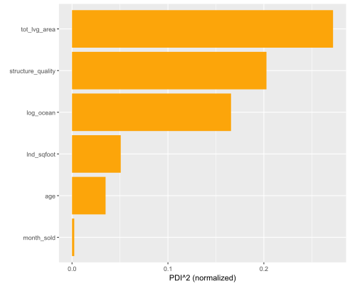

# interactML <a href='https://github.com/mayer79/interactML'></a>

<!-- badges: start -->

[](https://cran.r-project.org/package=interactML)
[](https://github.com/mayer79/interactML/actions)
[](https://app.codecov.io/gh/mayer79/interactML?branch=main)
[](https://www.tidyverse.org/lifecycle/#experimental)

[](https://cran.r-project.org/package=interactML) 
[](https://cran.r-project.org/package=interactML)

<!-- badges: end -->

## Overview

**What makes a ML model black-box? It's the interactions!**

This package helps to **quantify** their strength via statistics of Friedman and Popescu [1], and to **describe** them via partial dependence plots [2] and individual conditional expectation plots [7].

The main functions `interact()`, `partial_dep()`, and `ice()`

- work for **any model**,
- are **fast**,
- support multivariate predictions (e.g., probabilistic classification),
- respect case weights, and
- work with both data.frames and matrices (e.g., for XGBoost).

Furthermore, different variants of the original statistics in [1] are available.

DALEX explainers, meta learners (mlr3, tidymodels, caret) and most other models work out-of-the box. In case you need more flexibility, a prediction function `pred_fun()` can be passed to any of the main functions.

## Landscape

{interactML} is not the first package to explore interactions. Here is an incomplete selection:

- [{gbm}](https://CRAN.R-project.org/package=gbm): Implementation of m-wise interaction statistics of [1] for {gbm} models using the weighted tree-traversal method of [2] to estimate partial dependence functions.
- [{iml}](https://CRAN.R-project.org/package=iml): Variant of pairwise interaction statistics of [1].
- [{EIX}](https://CRAN.R-project.org/package=EIX): Interaction statistics extracted from the tree structure of XGBoost and LightGBM.
- [{randomForestExplainer}](https://CRAN.R-project.org/package=randomForestExplainer): Interaction statistics extracted from the tree structure of random forests.
- [{vivid}](https://CRAN.R-project.org/package=vivid): Cool visualization of interaction patterns. Partly based on {flashlight}.
- [{flashlight}](https://CRAN.R-project.org/package=flashlight): Model-agnostic implementation of some statistics of [1]. Planned to switch to the much faster {interactML}.

## Installation

```r
devtools::install_github("mayer79/interactML")
```

## Usage

To demonstrate the typical workflow, we use a beautiful house price dataset with about 14,000 transactions from Miami-Dade County available in the {shapviz} package, and analyzed in [3]. 

We are going to model logarithmic sales prices as a function of geographic features and other features like living area and building age. The model is fitted with XGBoost using interaction constraints to produce a model additive in all non-geographic features for maximal interpretability.

What can we say about interactions? Can we verify additivity in non-geographic features?

### Fit model

```r
library(interactML)
library(xgboost)
library(shapviz)

set.seed(1)

# Variable sets
x_geo <- c("LATITUDE", "LONGITUDE", "CNTR_DIST", "OCEAN_DIST", "RAIL_DIST", "HWY_DIST")
x_nongeo <- c("TOT_LVG_AREA", "LND_SQFOOT", "structure_quality", "age")
x <- c(x_geo, x_nongeo)

# Build interaction constraint vector
ic <- c(
  list(which(x %in% x_geo) - 1),
  as.list(which(x %in% x_nongeo) - 1)
)

# Train/valid split
ix <- sample(nrow(miami), 0.8 * nrow(miami))

y_train <- log(miami$SALE_PRC[ix])
y_valid <- log(miami$SALE_PRC[-ix])
X_train <- data.matrix(miami[ix, x])
X_valid <- data.matrix(miami[-ix, x])

dtrain <- xgb.DMatrix(X_train, label = y_train)
dvalid <- xgb.DMatrix(X_valid, label = y_valid)

# Fit
params <- list(
  learning_rate = 0.2,
  objective = "reg:squarederror",
  max_depth = 5,
  interaction_constraints = ic
)

fit <- xgb.train(
  params = params,
  data = dtrain,
  watchlist = list(valid = dvalid),
  early_stopping_rounds = 20,
  nrounds = 1000,
  callbacks = list(cb.print.evaluation(period = 100))
)

```

### Interaction statistics

```r
# 2-3 seconds on simple laptop - a random forest will take 1-2 minutes
set.seed(1)
system.time(
  inter <- interact(fit, v = x, X = X_train)
)
inter
# Proportion of prediction variability unexplained by main effects of v
# [1] 0.09602024

plot(inter)  # Or summary(inter) for numeric output
```


**Interpretation** 

- About 10% of prediction variability is unexplained by the sum of all main effects. The interaction effects seem to be quite important.
- The strongest overall interactions are associated with "OCEAN_DIST": About 6% of prediction variability can be attributed to its interactions.
- About 15.6% of the joint effect variability of OCEAN_DIST and LONGITUDE comes from their pairwise interaction.
- As desired, non-geographic features do not show any interactions.

**Remarks**

1. Pairwise statistics are calculated only for the features with strong overall interactions.
2. The statistics need to repeatedly calculate predictions on $n^2$ rows. That is why {interactML} samples 300 rows by default. To get more robust results, increase this value at the price of slower run time.
3. Pairwise Friedmans and Popescu's $H^2_{jk}$ measures interaction strength relative to the combined effect of the two features. This does not necessarily show which interactions are strongest in absolute numbers. To do so, we can study unnormalized statistics:

```r
H2_jk(inter, normalize = FALSE, squared = FALSE, top_m = 5)
```


Since distance to the ocean and longitude have high values in $H^2_j$, it is not surprising that a strong relative pairwise interaction is translated into a strong absolute one.

### Describe interactions

Let's study different plots to understand *how* the strong interaction between distance to the ocean and longitude looks like. We will check the following three visualizations.

1. Stratified PDP
2. Two-dimensional PDP
3. Centered ICE plot with colors

They all reveal a substantial interaction between the two variables (which would actually make a lot of sense on a Miami map).

```r
plot(partial_dep(fit, v = "LONGITUDE", X = X_train, BY = "OCEAN_DIST"))
```


```r
pd <- partial_dep(fit, v = c("LONGITUDE", "OCEAN_DIST"), X = X_train, grid_size = 1000)
plot(pd)
```


```r
ic <- ice(fit, v = "LONGITUDE", X = X_train, BY = log(X_train[, "OCEAN_DIST"]))
plot(ic, center = TRUE)
```


In contrast, no interactions are visible for living area:

```r
plot(partial_dep(fit, v = "TOT_LVG_AREA", X = X_train, BY = "OCEAN_DIST"))
```


```r
plot(ice(fit, v = "TOT_LVG_AREA", X = X_train, BY = "OCEAN_DIST"))
```


### Variable importance

In the spirit of [1], and related to [4], we can extract from the "interact" objects a partial dependence based variable importance measure. It is rather experimental, so use it with care (details below):

```r
pd_importance(inter)
```



## DALEX

The main functions work smoothly on DALEX explainers:

```r
library(DALEX)
library(ranger)
library(interactML)

set.seed(1)

fit <- ranger(Sepal.Length ~ ., data = iris)
ex <- explain(fit, data = iris[-1], y = iris[, 1])

inter <- interact(ex)
inter  # Non-additivity index 0.054
plot(inter)

# Strongest relative interaction
plot(ice(ex, v = "Sepal.Width", BY = "Petal.Width"), center = TRUE)
plot(partial_dep(ex, v = "Sepal.Width", BY = "Petal.Width"), show_points = FALSE)
plot(partial_dep(ex, v = c("Sepal.Width", "Petal.Width"), grid_size = 200))
```


Strongest relative interaction shown as ICE plot.


## Background

### Partial dependence

Let $F: R^p \to R$ denote the prediction function that maps the $p$-dimensional feature vector $\boldsymbol x = (x_1, \dots, x_p)$ to its prediction.
Furthermore, let $F_s(\boldsymbol x_s) = E_{\boldsymbol x_{\setminus s}}(F(\boldsymbol x_s, \boldsymbol x_{\setminus s}))$ be the partial dependence function of $F$ on the feature subset $\boldsymbol x_s$, where $s \subseteq \{1, \dots, p\}$, as introduced in [2]. Here, the expectation runs over the joint marginal distribution of features $\boldsymbol x_{\setminus s}$ not in $\boldsymbol x_s$.

Given data, $F_s(\boldsymbol x_s)$ can be estimated by the empirical partial dependence function

$$
  \hat F_s(\boldsymbol x_s) = \frac{1}{n} \sum_{i = 1}^n F(\boldsymbol x_s, \boldsymbol x_{i \setminus s}),
$$

where $\boldsymbol x_{i\setminus s}$, $i = 1, \dots, n$, are the observed values of $\boldsymbol x_{\setminus s}$.

A partial dependence plot (PDP) plots the values of $\hat F_s(\boldsymbol x_s)$
over a grid of evaluation points $\boldsymbol x_s$. Its disaggregated version is called
*individual conditional expectation* (ICE), see [7].

### Interactions

#### Overall interaction strength

In [1], Friedman and Popescu introduced different statistics to measure interaction strength. Closely following their notation, we will summarize the main ideas. 

If there are no interactions involving $x_j$, we can decompose the prediction function $F$ into the sum of the partial dependence $F_j$ on $x_j$ and the partial dependence $F_{\setminus j}$ on all other features $\boldsymbol x_{\setminus j}$, i.e.,

$$
	F(\boldsymbol x) = F_j(x_j) + F_{\setminus j}(\boldsymbol x_{\setminus j}).
$$

Correspondingly, Friedman and Popescu's $H^2_j$ statistic of overall interaction strength is given by

$$
	H_{j}^2 = \frac{\frac{1}{n} \sum_{i = 1}^n\big[F(\boldsymbol x_i) - \hat F_j(x_{ij}) - \hat F_{\setminus j}(\boldsymbol x_{i\setminus j})\big]^2}{\frac{1}{n} \sum_{i = 1}^n\big[F(\boldsymbol x_i)\big]^2}.
$$

**Remarks**

1. Partial dependence functions (and $F$) are all centered to mean 0.
2. Partial dependence functions (and $F$) are evaluated over the data distribution. This is different to partial dependence plots, where one uses a fixed grid.
3. Weighted versions follow by replacing all arithmetic means by corresponding weighted means.
4. Multivariate predictions can be treated in a component-wise manner.
5. $H^2_j = 0$ means there are no interactions associated with $x_j$. The higher the value, the more prediction variability comes from interactions with $x_j$.
6. Since the denominator is the same for all features, the values of the test statistics can be compared across features.

#### Pairwise interaction strength

Again following [1], if there are no interaction effects between features $x_j$ and $x_k$, their two-dimensional partial dependence function $F_{jk}$ can be written as the sum of the univariate partial dependencies, i.e.,

$$
  F_{jk}(x_j, x_k) = F_j(x_j)+ F_k(x_k).
$$

Correspondingly, Friedman and Popescu's $H_{jk}^2$ statistic of pairwise interaction strength is defined as

$$
  H_{jk}^2 = \frac{A_{jk}}{B_{jk}},
$$

where 

$$
  A_{jk} = \frac{1}{n} \sum_{i = 1}^n\big[\hat F_{jk}(x_{ij}, x_{ik}) - \hat F_j(x_{ij}) - \hat F_k(x_{ik})\big]^2
$$

and

$$
  B_{jk} = \frac{1}{n} \sum_{i = 1}^n\big[\hat F_{jk}(x_{ij}, x_{ik})\big]^2.
$$ 

**Remarks**

1. Remarks 1 to 4 of $H^2_{j}$ also apply here.
2. $H^2_{jk} = 0$ means there are no interaction effects between $x_j$ and $x_k$. The larger the value, the more of the joint effect of the two features comes from the interaction.
3.  Since the denominator differs between variable pairs, unlike $H_j$, this test statistic is difficult to compare between variable pairs. If both main effects are very weak, a negligible interaction can get a high $H^2_{jk}$.

**Modification**

To be better able to compare pairwise interaction strength across variable pairs, and to overcome the problem mentioned in the last remark, we suggest as alternative the unnormalized test statistic on the scale of the predictions, i.e., $\sqrt{A_{jk}}$. 

Furthermore, we do pairwise calculations not for the most *important* features but rather for those features with *strongest overall interactions*.

#### Total interaction strength of all variables together

If the model is additive in all features (no interactions), then

$$
	F(\boldsymbol x) = \sum_{j}^{p} F_j(x_j),
$$

i.e., the (centered) predictions can be written as the sum of the (centered) main effects.

To measure the relative amount of variability unexplained by all main effects, we can therefore study the test statistic of total interaction strength

$$
  H^2 = \frac{\frac{1}{n} \sum_{i = 1}^n \left[F(\boldsymbol x_i) - \sum_{j = 1}^p\hat F_j(x_{ij})\right]^2}{\frac{1}{n} \sum_{i = 1}^n\left[F(\boldsymbol x_i)\right]^2}.
$$

A value of 0 means there are no interaction effects at all. 

In [5], $1 - H^2$ is called *additivity index*. A similar measure using accumulated local effects is discussed in [6].

#### Workflow

Calculation of all $H_j^2$ statistics requires $O(n^2 p)$ predictions, while calculating of all pairwise $H_{jk}$ requires $O(n^2 p^2$ predictions. Therefore, we suggest to reduce the workflow in two important ways:

1. Evaluate the statistics only on a subset of the data, e.g., on $n' = 300$ observations.
2. Calculate $H_j^2$ for all features. Then, select a small number $m = O(\sqrt{p})$ of features with highest $H^2_j$ and do pairwise calculations only on this subset.

This leads to a total number of $O(n'^2 p)$ predictions.

### Variable importance (experimental)

[4] proposed the standard deviation of the partial dependence function as a measure of variable importance (for continuous predictors). 

Since the partial dependence function suppresses interaction effects, we propose a different measure in the spirit of the interaction statistics above: If $x_j$ has no effects, the (centered) prediction function $F$ equals the (centered) partial dependence $F_{\setminus j}$ on all other features $\boldsymbol x_{\setminus j}$, i.e.,

$$
	F(\boldsymbol x) = F_{\setminus j}(\boldsymbol x_{\setminus j}).
$$

Therefore, the following measure of variable importance follows:

$$
	Imp_{j} = \frac{\frac{1}{n} \sum_{i = 1}^n\big[F(\boldsymbol x_i) - \hat F_{\setminus j}(\boldsymbol x_{i\setminus j})\big]^2}{\frac{1}{n} \sum_{i = 1}^n\big[F(\boldsymbol x_i)\big]^2}.
$$

It differs from $H^2_j$ only by not subtracting the main effect of the $j$-th feature in the numerator. It can be read as the proportion of prediction variability unexplained by all other features. As such, it measures variable importance of the $j$-th feature, including its interaction effects.

## References

1. Friedman, Jerome H., and Bogdan E. Popescu. *Predictive Learning via Rule Ensembles.*
  The Annals of Applied Statistics 2, no. 3 (2008): 916-54.
2. Friedman, Jerome H. *Greedy Function Approximation: A Gradient Boosting Machine.* 
  Annals of Statistics 29, no. 5 (2001): 1189-1232.
3. Mayer, Michael, Steven C. Bourassa, Martin Hoesli, and Donato Scognamiglio. *Machine Learning Applications to Land and Structure Valuation."* Journal of Risk and Financial Management 15, no. 5 (2022): 193.
4. Greenwell, Brandon M., Bradley C. Boehmke, and Andrew J. McCarthy. 
*A Simple and Effective Model-Based Variable Importance Measure.* Arxiv (2018).
5. Żółkowski, Artur, Mateusz Krzyziński, and Paweł Fijałkowski. *Methods for extraction of interactions from predictive models.* Undergraduate thesis. Faculty of Mathematics and Information Science, Warsaw University of Technology (2023).
6. Molnar, Christoph, Giuseppe Casalicchio, and Bernd Bischl". *Quantifying Model Complexity via Functional Decomposition for Better Post-hoc Interpretability*, in Machine Learning and Knowledge Discovery in Databases, Springer International Publishing (2020): 193-204.
7. Goldstein, Alex, Adam Kapelner, Justin Bleich, and Emil Pitkin. *Peeking inside the black box: Visualizing statistical learning with plots of individual conditional expectation.* Journal of Computational and Graphical Statistics, 24, no. 1 (2015): 44-65.
